# DATABASE.md — GitHub Clone Database Design

> Design only, no code. PostgreSQL-flavored types used as reference. All tables use `id UUID PRIMARY KEY DEFAULT gen_random_uuid()` unless noted. `created_at` / `updated_at` timestamps are implied on every table and omitted below for brevity except where they carry special meaning.

---

## 1. Table Definitions

### users
Core identity table.
| Column | Type | Notes |
|---|---|---|
| id | UUID | PK |
| username | VARCHAR(39) | UNIQUE, NOT NULL |
| email | VARCHAR(255) | UNIQUE, NOT NULL |
| password_hash | VARCHAR(255) | NULL if OAuth-only |
| full_name | VARCHAR(255) | |
| avatar_url | TEXT | |
| bio | TEXT | |
| location | VARCHAR(255) | |
| website_url | TEXT | |
| is_verified | BOOLEAN | email verified |
| two_factor_enabled | BOOLEAN | |
| account_type | ENUM | `user`, `bot` |
| created_at | TIMESTAMP | |

### organizations
| Column | Type | Notes |
|---|---|---|
| id | UUID | PK |
| slug | VARCHAR(39) | UNIQUE |
| name | VARCHAR(255) | |
| description | TEXT | |
| avatar_url | TEXT | |
| billing_email | VARCHAR(255) | |
| owner_id | UUID | FK → users.id (creator, not sole owner) |
| plan | ENUM | `free`, `team`, `enterprise` |

### organization_members
Join table, user ↔ org, with org-level role.
| Column | Type | Notes |
|---|---|---|
| id | UUID | PK |
| organization_id | UUID | FK → organizations.id |
| user_id | UUID | FK → users.id |
| role | ENUM | `owner`, `member`, `billing_manager` |
| UNIQUE(organization_id, user_id) | | |

### teams
| Column | Type | Notes |
|---|---|---|
| id | UUID | PK |
| organization_id | UUID | FK → organizations.id |
| parent_team_id | UUID | FK → teams.id, NULL if top-level (nested teams) |
| name | VARCHAR(255) | |
| slug | VARCHAR(255) | |
| privacy | ENUM | `secret`, `visible` |

### team_members
| Column | Type | Notes |
|---|---|---|
| id | UUID | PK |
| team_id | UUID | FK → teams.id |
| user_id | UUID | FK → users.id |
| role | ENUM | `member`, `maintainer` |
| UNIQUE(team_id, user_id) | | |

### repositories
| Column | Type | Notes |
|---|---|---|
| id | UUID | PK |
| owner_id | UUID | FK → users.id, NULL if org-owned |
| organization_id | UUID | FK → organizations.id, NULL if user-owned |
| name | VARCHAR(255) | |
| slug | VARCHAR(255) | URL-safe |
| description | TEXT | |
| visibility | ENUM | `public`, `private`, `internal` |
| default_branch | VARCHAR(255) | default `main` |
| is_archived | BOOLEAN | |
| is_fork | BOOLEAN | |
| forked_from_id | UUID | FK → repositories.id, NULL if not a fork |
| license | VARCHAR(50) | e.g. `MIT` |
| star_count | INT | denormalized counter |
| watch_count | INT | denormalized counter |
| CHECK (owner_id IS NOT NULL OR organization_id IS NOT NULL) | | exactly one owner type |

### branches
| Column | Type | Notes |
|---|---|---|
| id | UUID | PK |
| repository_id | UUID | FK → repositories.id |
| name | VARCHAR(255) | |
| head_commit_id | UUID | FK → commits.id |
| is_protected | BOOLEAN | |
| UNIQUE(repository_id, name) | | |

### branch_protection_rules
| Column | Type | Notes |
|---|---|---|
| id | UUID | PK |
| branch_id | UUID | FK → branches.id |
| require_pr | BOOLEAN | |
| required_approvals | INT | |
| require_status_checks | BOOLEAN | |
| require_signed_commits | BOOLEAN | |
| restrict_push_to | UUID[] | array of team/user IDs allowed to push directly |

### commits
| Column | Type | Notes |
|---|---|---|
| id | UUID | PK (app-level id; store real Git SHA separately) |
| repository_id | UUID | FK → repositories.id |
| sha | CHAR(40) | actual Git object hash, UNIQUE per repo |
| parent_sha | CHAR(40) | NULL if root commit; store multiple parents in a join table for merge commits |
| author_id | UUID | FK → users.id, NULL if author email unmatched to an account |
| author_email | VARCHAR(255) | raw Git author field, always stored |
| committer_id | UUID | FK → users.id |
| message | TEXT | |
| tree_sha | CHAR(40) | root tree hash |
| authored_at | TIMESTAMP | |
| committed_at | TIMESTAMP | |

### commit_parents
Join table so merge commits (2+ parents) are modeled correctly instead of a single `parent_sha` column.
| Column | Type | Notes |
|---|---|---|
| commit_id | UUID | FK → commits.id |
| parent_commit_id | UUID | FK → commits.id |
| parent_order | INT | 0 = first parent, 1 = second parent (merge) |

### files
Represents a blob's logical path at a point in time (metadata layer over Git blobs — actual byte content lives in object/blob storage, not the relational DB).
| Column | Type | Notes |
|---|---|---|
| id | UUID | PK |
| repository_id | UUID | FK → repositories.id |
| commit_id | UUID | FK → commits.id |
| folder_id | UUID | FK → folders.id, NULL if root-level |
| path | TEXT | full path within repo |
| blob_sha | CHAR(40) | Git blob hash |
| size_bytes | BIGINT | |
| mode | VARCHAR(6) | e.g. `100644`, `100755`, `120000` |

### folders
| Column | Type | Notes |
|---|---|---|
| id | UUID | PK |
| repository_id | UUID | FK → repositories.id |
| commit_id | UUID | FK → commits.id |
| parent_folder_id | UUID | FK → folders.id, NULL if root |
| path | TEXT | |

### issues
| Column | Type | Notes |
|---|---|---|
| id | UUID | PK |
| repository_id | UUID | FK → repositories.id |
| number | INT | per-repo sequential number (shown as `#42`) |
| title | VARCHAR(255) | |
| body | TEXT | |
| author_id | UUID | FK → users.id |
| state | ENUM | `open`, `closed` |
| closed_at | TIMESTAMP | NULL if open |
| closed_by_id | UUID | FK → users.id |
| milestone_id | UUID | FK → milestones.id, NULL |
| UNIQUE(repository_id, number) | | |

### issue_assignees
| Column | Type | Notes |
|---|---|---|
| issue_id | UUID | FK → issues.id |
| user_id | UUID | FK → users.id |
| PK(issue_id, user_id) | | |

### issue_labels
| Column | Type | Notes |
|---|---|---|
| issue_id | UUID | FK → issues.id |
| label_id | UUID | FK → labels.id |
| PK(issue_id, label_id) | | |

### labels
| Column | Type | Notes |
|---|---|---|
| id | UUID | PK |
| repository_id | UUID | FK → repositories.id |
| name | VARCHAR(50) | |
| color | CHAR(6) | hex |
| description | VARCHAR(255) | |
| UNIQUE(repository_id, name) | | |

### milestones
| Column | Type | Notes |
|---|---|---|
| id | UUID | PK |
| repository_id | UUID | FK → repositories.id |
| title | VARCHAR(255) | |
| description | TEXT | |
| due_date | DATE | |
| state | ENUM | `open`, `closed` |

### pull_requests
| Column | Type | Notes |
|---|---|---|
| id | UUID | PK |
| repository_id | UUID | FK → repositories.id |
| number | INT | shared numbering sequence with issues (GitHub does this — a PR is technically an issue subtype) |
| issue_id | UUID | FK → issues.id, 1:1 — PRs extend the issues table conceptually |
| title | VARCHAR(255) | |
| author_id | UUID | FK → users.id |
| source_repository_id | UUID | FK → repositories.id (fork support) |
| source_branch | VARCHAR(255) | |
| target_repository_id | UUID | FK → repositories.id |
| target_branch | VARCHAR(255) | |
| state | ENUM | `open`, `closed`, `merged` |
| is_draft | BOOLEAN | |
| merged_at | TIMESTAMP | NULL |
| merged_by_id | UUID | FK → users.id |
| merge_commit_sha | CHAR(40) | NULL until merged |
| merge_strategy | ENUM | `merge`, `squash`, `rebase` |

### pr_reviews
| Column | Type | Notes |
|---|---|---|
| id | UUID | PK |
| pull_request_id | UUID | FK → pull_requests.id |
| reviewer_id | UUID | FK → users.id |
| state | ENUM | `approved`, `changes_requested`, `commented` |
| submitted_at | TIMESTAMP | |

### pr_review_comments
Inline diff comments (distinct from general PR conversation comments, which reuse the `comments` table).
| Column | Type | Notes |
|---|---|---|
| id | UUID | PK |
| review_id | UUID | FK → pr_reviews.id |
| file_path | TEXT | |
| line_number | INT | |
| diff_side | ENUM | `old`, `new` |
| body | TEXT | |

### comments
Polymorphic comment table shared across issues, PRs, discussions, commits.
| Column | Type | Notes |
|---|---|---|
| id | UUID | PK |
| author_id | UUID | FK → users.id |
| body | TEXT | |
| commentable_type | ENUM | `issue`, `pull_request`, `discussion`, `commit` |
| commentable_id | UUID | polymorphic target id |
| edited_at | TIMESTAMP | NULL |

### discussions
| Column | Type | Notes |
|---|---|---|
| id | UUID | PK |
| repository_id | UUID | FK → repositories.id |
| category | ENUM | `q_and_a`, `ideas`, `announcements`, `general`, `show_and_tell` |
| title | VARCHAR(255) | |
| body | TEXT | |
| author_id | UUID | FK → users.id |
| answered_comment_id | UUID | FK → comments.id, NULL — marks accepted answer for Q&A |

### wiki_pages
| Column | Type | Notes |
|---|---|---|
| id | UUID | PK |
| repository_id | UUID | FK → repositories.id |
| slug | VARCHAR(255) | |
| title | VARCHAR(255) | |
| body_markdown | TEXT | |
| last_edited_by | UUID | FK → users.id |

### projects
GitHub Projects (kanban/table board).
| Column | Type | Notes |
|---|---|---|
| id | UUID | PK |
| organization_id | UUID | FK → organizations.id, NULL if repo-scoped |
| repository_id | UUID | FK → repositories.id, NULL if org-scoped |
| title | VARCHAR(255) | |
| view_type | ENUM | `board`, `table`, `roadmap` |

### project_items
| Column | Type | Notes |
|---|---|---|
| id | UUID | PK |
| project_id | UUID | FK → projects.id |
| item_type | ENUM | `issue`, `pull_request`, `note` |
| item_id | UUID | polymorphic target |
| status_column | VARCHAR(100) | e.g. `Todo`, `In Progress`, `Done` |
| position | INT | ordering within column |

### releases
| Column | Type | Notes |
|---|---|---|
| id | UUID | PK |
| repository_id | UUID | FK → repositories.id |
| tag_name | VARCHAR(255) | e.g. `v1.2.0` |
| target_commit_sha | CHAR(40) | |
| title | VARCHAR(255) | |
| body_markdown | TEXT | changelog |
| is_prerelease | BOOLEAN | |
| is_draft | BOOLEAN | |
| author_id | UUID | FK → users.id |
| published_at | TIMESTAMP | |

### release_assets
| Column | Type | Notes |
|---|---|---|
| id | UUID | PK |
| release_id | UUID | FK → releases.id |
| file_name | VARCHAR(255) | |
| file_url | TEXT | points to object storage (S3-compatible) |
| size_bytes | BIGINT | |
| download_count | INT | |

### workflows
GitHub Actions workflow definitions.
| Column | Type | Notes |
|---|---|---|
| id | UUID | PK |
| repository_id | UUID | FK → repositories.id |
| file_path | VARCHAR(255) | e.g. `.github/workflows/ci.yml` |
| name | VARCHAR(255) | |
| is_active | BOOLEAN | |

### workflow_runs
| Column | Type | Notes |
|---|---|---|
| id | UUID | PK |
| workflow_id | UUID | FK → workflows.id |
| commit_sha | CHAR(40) | |
| trigger_event | ENUM | `push`, `pull_request`, `schedule`, `workflow_dispatch` |
| status | ENUM | `queued`, `in_progress`, `success`, `failure`, `cancelled` |
| triggered_by_id | UUID | FK → users.id |
| started_at | TIMESTAMP | |
| completed_at | TIMESTAMP | |

### workflow_jobs
| Column | Type | Notes |
|---|---|---|
| id | UUID | PK |
| workflow_run_id | UUID | FK → workflow_runs.id |
| runner_id | UUID | FK → runners.id, NULL until assigned |
| name | VARCHAR(255) | |
| status | ENUM | same as workflow_runs |
| logs_url | TEXT | points to log blob storage |

### runners
| Column | Type | Notes |
|---|---|---|
| id | UUID | PK |
| organization_id | UUID | FK → organizations.id, NULL if repo-scoped |
| repository_id | UUID | FK → repositories.id, NULL if org/enterprise-scoped |
| name | VARCHAR(255) | |
| os | VARCHAR(50) | |
| is_self_hosted | BOOLEAN | |
| status | ENUM | `online`, `offline`, `busy` |

### artifacts
Build outputs uploaded from a workflow run.
| Column | Type | Notes |
|---|---|---|
| id | UUID | PK |
| workflow_run_id | UUID | FK → workflow_runs.id |
| name | VARCHAR(255) | |
| file_url | TEXT | object storage |
| size_bytes | BIGINT | |
| expires_at | TIMESTAMP | |

### secrets
Encrypted CI/CD secrets — value itself never stored in plaintext relationally.
| Column | Type | Notes |
|---|---|---|
| id | UUID | PK |
| repository_id | UUID | FK → repositories.id, NULL if org-scoped |
| organization_id | UUID | FK → organizations.id, NULL if repo-scoped |
| name | VARCHAR(255) | |
| encrypted_value | TEXT | encrypted at rest via KMS, app never returns plaintext after write |
| created_by_id | UUID | FK → users.id |

### packages
GitHub Packages registry entries.
| Column | Type | Notes |
|---|---|---|
| id | UUID | PK |
| repository_id | UUID | FK → repositories.id |
| name | VARCHAR(255) | |
| package_type | ENUM | `npm`, `docker`, `maven`, `nuget`, `rubygems` |
| visibility | ENUM | `public`, `private` |

### package_versions
| Column | Type | Notes |
|---|---|---|
| id | UUID | PK |
| package_id | UUID | FK → packages.id |
| version | VARCHAR(50) | SemVer string |
| file_url | TEXT | object storage |
| published_at | TIMESTAMP | |

### stars
| Column | Type | Notes |
|---|---|---|
| user_id | UUID | FK → users.id |
| repository_id | UUID | FK → repositories.id |
| starred_at | TIMESTAMP | |
| PK(user_id, repository_id) | | |

### watchers
| Column | Type | Notes |
|---|---|---|
| user_id | UUID | FK → users.id |
| repository_id | UUID | FK → repositories.id |
| notification_level | ENUM | `all`, `participating`, `ignore` |
| PK(user_id, repository_id) | | |

### followers
Self-referential many-to-many on users.
| Column | Type | Notes |
|---|---|---|
| follower_id | UUID | FK → users.id |
| followed_id | UUID | FK → users.id |
| PK(follower_id, followed_id) | | |

### permissions
Explicit per-repo access grants for individual users or teams (in addition to org-role defaults).
| Column | Type | Notes |
|---|---|---|
| id | UUID | PK |
| repository_id | UUID | FK → repositories.id |
| grantee_type | ENUM | `user`, `team` |
| grantee_id | UUID | polymorphic → users.id or teams.id |
| access_level | ENUM | `read`, `triage`, `write`, `maintain`, `admin` |

### notifications
| Column | Type | Notes |
|---|---|---|
| id | UUID | PK |
| recipient_id | UUID | FK → users.id |
| repository_id | UUID | FK → repositories.id |
| notifiable_type | ENUM | `issue`, `pull_request`, `discussion`, `release`, `mention` |
| notifiable_id | UUID | polymorphic target |
| reason | ENUM | `mention`, `assign`, `review_requested`, `subscribed` |
| is_read | BOOLEAN | |
| is_unsubscribed | BOOLEAN | |

### sessions
Web login sessions (browser-based auth).
| Column | Type | Notes |
|---|---|---|
| id | UUID | PK |
| user_id | UUID | FK → users.id |
| session_token_hash | VARCHAR(255) | hashed, never store raw token |
| ip_address | INET | |
| user_agent | TEXT | |
| expires_at | TIMESTAMP | |

### personal_access_tokens
| Column | Type | Notes |
|---|---|---|
| id | UUID | PK |
| user_id | UUID | FK → users.id |
| name | VARCHAR(255) | user-given label |
| token_hash | VARCHAR(255) | hashed, never store raw |
| scopes | VARCHAR(50)[] | e.g. `repo`, `workflow`, `read:org` |
| expires_at | TIMESTAMP | NULL = no expiry (discouraged) |
| last_used_at | TIMESTAMP | |

### ssh_keys
| Column | Type | Notes |
|---|---|---|
| id | UUID | PK |
| user_id | UUID | FK → users.id |
| title | VARCHAR(255) | |
| public_key | TEXT | |
| fingerprint | VARCHAR(255) | UNIQUE |
| key_type | ENUM | `authentication`, `signing` |

### webhooks
| Column | Type | Notes |
|---|---|---|
| id | UUID | PK |
| repository_id | UUID | FK → repositories.id, NULL if org-scoped |
| organization_id | UUID | FK → organizations.id, NULL if repo-scoped |
| target_url | TEXT | |
| secret_hash | VARCHAR(255) | for payload signature verification |
| events | VARCHAR(50)[] | e.g. `push`, `pull_request`, `issues` |
| is_active | BOOLEAN | |

### audit_logs
Immutable, append-only.
| Column | Type | Notes |
|---|---|---|
| id | UUID | PK |
| actor_id | UUID | FK → users.id |
| organization_id | UUID | FK → organizations.id, NULL |
| action | VARCHAR(100) | e.g. `repo.create`, `member.remove`, `secret.update` |
| target_type | VARCHAR(50) | |
| target_id | UUID | polymorphic |
| ip_address | INET | |
| created_at | TIMESTAMP | no `updated_at` — logs never mutate |

### activities
Feed events for the dashboard/timeline (e.g. "X pushed to Y", "X opened PR #12").
| Column | Type | Notes |
|---|---|---|
| id | UUID | PK |
| actor_id | UUID | FK → users.id |
| repository_id | UUID | FK → repositories.id |
| activity_type | ENUM | `push`, `pr_opened`, `pr_merged`, `issue_opened`, `star`, `fork`, `release` |
| target_id | UUID | polymorphic reference to the relevant commit/PR/issue/release |
| created_at | TIMESTAMP | |

---

## 2. Key Design Decisions

- **Blob content lives outside the relational DB.** `files`/`commits` store Git SHAs and metadata; actual file bytes and Git objects belong in object storage (S3-compatible) or a dedicated Git storage layer (e.g. bare repos on disk, addressed by SHA) — mirrors how real GitHub separates metadata (MySQL historically) from Git storage (Spokes/DGit).
- **PRs are issues under the hood.** `pull_requests.issue_id` gives PRs the comment thread, labels, assignees, and numbering system for free via the shared `issues`/`comments` tables — this is how GitHub's real schema works too.
- **Polymorphic tables** (`comments`, `notifications`, `activities`, `project_items`) trade referential-integrity strictness for flexibility across many "commentable"/"notifiable" entities. Trade-off: enforce validity at the application layer or via CHECK constraints + partial indexes, since native FKs can't span multiple target tables.
- **Owner polymorphism on `repositories`/`secrets`/`webhooks`/`runners`.** A CHECK constraint enforces exactly one of `owner_id`/`organization_id` (or `repository_id`/`organization_id`) is set — mirrors GitHub's real personal-vs-org repo distinction.
- **Merge commits use a join table (`commit_parents`)** instead of a single `parent_sha` column, since Git merge commits have 2+ parents — a single FK column can't represent that.
- **Secrets/tokens/session identifiers are always stored hashed or encrypted**, never in plaintext, consistent with real security practice.
- **Audit logs are append-only** — no `updated_at`, no update/delete path at the application layer, for compliance integrity.

---

## 3. ER Diagram (Mermaid)

```mermaid
erDiagram
    USERS ||--o{ ORGANIZATION_MEMBERS : "has"
    ORGANIZATIONS ||--o{ ORGANIZATION_MEMBERS : "has"
    ORGANIZATIONS ||--o{ TEAMS : "has"
    TEAMS ||--o{ TEAM_MEMBERS : "has"
    USERS ||--o{ TEAM_MEMBERS : "belongs to"
    TEAMS }o--o| TEAMS : "parent_team"

    USERS ||--o{ REPOSITORIES : "owns"
    ORGANIZATIONS ||--o{ REPOSITORIES : "owns"
    REPOSITORIES ||--o{ REPOSITORIES : "forked_from"
    REPOSITORIES ||--o{ BRANCHES : "has"
    BRANCHES ||--o| BRANCH_PROTECTION_RULES : "protected_by"
    REPOSITORIES ||--o{ COMMITS : "has"
    COMMITS ||--o{ COMMIT_PARENTS : "has"
    COMMITS ||--o{ FILES : "snapshot_of"
    REPOSITORIES ||--o{ FOLDERS : "has"
    USERS ||--o{ COMMITS : "authors"

    REPOSITORIES ||--o{ ISSUES : "has"
    ISSUES ||--o{ ISSUE_ASSIGNEES : "has"
    USERS ||--o{ ISSUE_ASSIGNEES : "assigned"
    ISSUES ||--o{ ISSUE_LABELS : "has"
    REPOSITORIES ||--o{ LABELS : "defines"
    LABELS ||--o{ ISSUE_LABELS : "tags"
    REPOSITORIES ||--o{ MILESTONES : "defines"
    MILESTONES ||--o{ ISSUES : "groups"
    USERS ||--o{ ISSUES : "authors"

    ISSUES ||--o| PULL_REQUESTS : "extends"
    REPOSITORIES ||--o{ PULL_REQUESTS : "has"
    PULL_REQUESTS ||--o{ PR_REVIEWS : "has"
    USERS ||--o{ PR_REVIEWS : "reviews"
    PR_REVIEWS ||--o{ PR_REVIEW_COMMENTS : "has"

    USERS ||--o{ COMMENTS : "authors"
    ISSUES ||--o{ COMMENTS : "has"
    PULL_REQUESTS ||--o{ COMMENTS : "has"
    DISCUSSIONS ||--o{ COMMENTS : "has"

    REPOSITORIES ||--o{ DISCUSSIONS : "has"
    REPOSITORIES ||--o{ WIKI_PAGES : "has"

    ORGANIZATIONS ||--o{ PROJECTS : "owns"
    REPOSITORIES ||--o{ PROJECTS : "owns"
    PROJECTS ||--o{ PROJECT_ITEMS : "contains"

    REPOSITORIES ||--o{ RELEASES : "has"
    RELEASES ||--o{ RELEASE_ASSETS : "has"

    REPOSITORIES ||--o{ WORKFLOWS : "defines"
    WORKFLOWS ||--o{ WORKFLOW_RUNS : "has"
    WORKFLOW_RUNS ||--o{ WORKFLOW_JOBS : "has"
    WORKFLOW_JOBS }o--o| RUNNERS : "runs_on"
    WORKFLOW_RUNS ||--o{ ARTIFACTS : "produces"
    REPOSITORIES ||--o{ SECRETS : "has"
    ORGANIZATIONS ||--o{ SECRETS : "has"

    REPOSITORIES ||--o{ PACKAGES : "publishes"
    PACKAGES ||--o{ PACKAGE_VERSIONS : "has"

    USERS ||--o{ STARS : "stars"
    REPOSITORIES ||--o{ STARS : "starred_by"
    USERS ||--o{ WATCHERS : "watches"
    REPOSITORIES ||--o{ WATCHERS : "watched_by"
    USERS ||--o{ FOLLOWERS : "follows"

    REPOSITORIES ||--o{ PERMISSIONS : "grants"
    USERS ||--o{ NOTIFICATIONS : "receives"
    USERS ||--o{ SESSIONS : "has"
    USERS ||--o{ PERSONAL_ACCESS_TOKENS : "has"
    USERS ||--o{ SSH_KEYS : "has"
    REPOSITORIES ||--o{ WEBHOOKS : "has"
    ORGANIZATIONS ||--o{ WEBHOOKS : "has"
    ORGANIZATIONS ||--o{ AUDIT_LOGS : "logs"
    USERS ||--o{ ACTIVITIES : "generates"
```



### Simplified ASCII overview (core object graph)

```
                     ┌───────────────┐
                     │     USERS     │
                     └───────┬───────┘
           ┌──────────┬──────┼──────┬────────────┬─────────────┐
           ▼          ▼      ▼      ▼            ▼             ▼
   ORG_MEMBERS   TEAM_MEMBERS  SESSIONS   SSH_KEYS/PATs   STARS/WATCHERS/FOLLOWERS
           │          │
           ▼          ▼
   ORGANIZATIONS ── TEAMS
           │
           ▼
     REPOSITORIES ──────────────┬───────────────┬───────────────┐
     │  │  │  │                 ▼               ▼               ▼
     │  │  │  └──► BRANCHES  RELEASES        WORKFLOWS       PACKAGES
     │  │  │         │          │                │                │
     │  │  │         ▼          ▼                ▼                ▼
     │  │  │   PROTECTION   ASSETS      RUNS→JOBS→ARTIFACTS   VERSIONS
     │  │  │
     │  │  └──► COMMITS ──► COMMIT_PARENTS
     │  │              └──► FILES / FOLDERS
     │  │
     │  └──► ISSUES ──► PULL_REQUESTS (1:1 extension)
     │           │             │
     │           ▼             ▼
     │      ASSIGNEES      PR_REVIEWS ──► PR_REVIEW_COMMENTS
     │           ▼
     │        LABELS / MILESTONES
     │
     └──► DISCUSSIONS / WIKI_PAGES / PROJECTS / SECRETS / WEBHOOKS
                          all ──► COMMENTS (polymorphic)
```

---

## 4. Indexing Notes (design-level, not code)

- `repositories(owner_id)`, `repositories(organization_id)`, `repositories(slug)` — lookup by owner/name (`github.com/user/repo` pattern).
- `commits(repository_id, sha)` — unique composite index, primary lookup path.
- `issues(repository_id, number)`, `pull_requests(repository_id, number)` — unique composite, since numbers are per-repo not global.
- `notifications(recipient_id, is_read)` — partial index on unread for fast inbox queries.
- `stars(repository_id)`, `watchers(repository_id)` — for computing star/watch counts (though counts should be denormalized onto `repositories` and updated via trigger/queue, not counted live at scale).
- `audit_logs(organization_id, created_at)` — time-range queries for compliance exports.

---

## 5. Scaling Considerations (design-level)

- Git object storage (blobs/trees/commits' actual bytes) should **not** live in the same relational database as metadata — it belongs in a content-addressable store (disk-based bare repos, or a service like GitHub's Spokes) sharded by repository.
- `activities` and `notifications` are the highest write-volume tables — candidates for a queue-backed async write path and eventual read-replica/sharding by user or time.
- `audit_logs` should be append-only and likely lives in a separate, write-optimized store (or partitioned monthly) rather than the primary OLTP database, since it's compliance data rarely queried transactionally.
